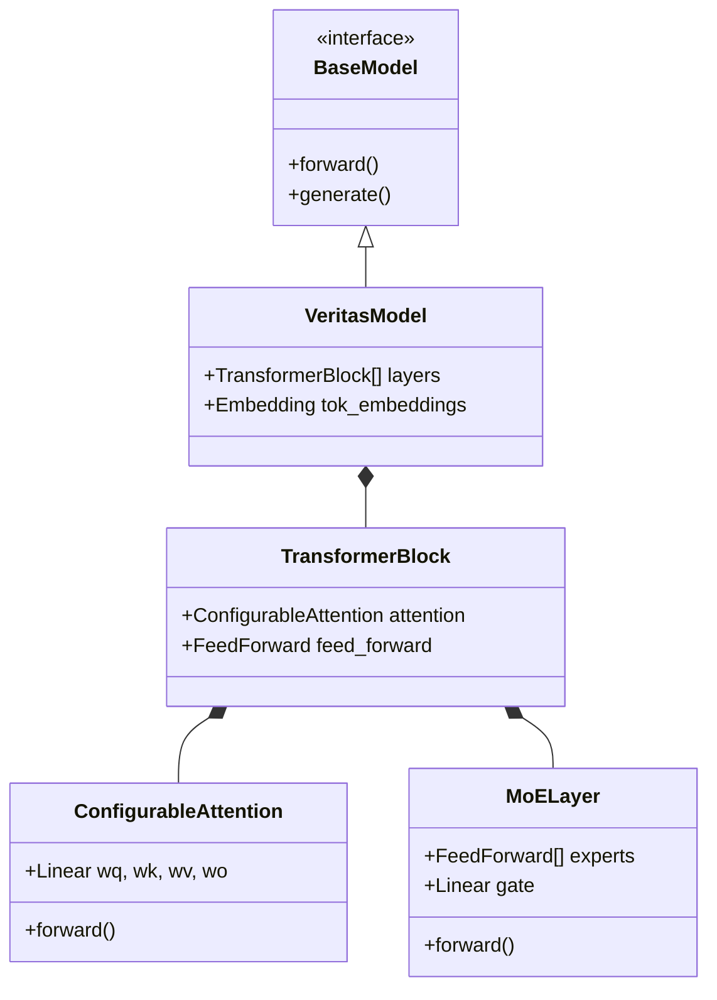

# VeritasLLM Architecture

## Overview

VeritasLLM is designed to be **modular** and **hackable**. The core components are decoupled to allow easy experimentation.

## Key Modules

### 1. Configuration (`config/`)
*   **Hydra** based.
*   Hierarchical structure: `model`, `data`, `training`, `experiment`.
*   Supports variable interpolation and sweeps.

### 2. Core (`src/core/`)
*   Defines abstract base classes (`BaseModel`, `BaseTrainer`).
*   Ensures consistent interfaces across different implementations.

### 3. Model (`src/model/`)
*   **`ConfigurableAttention`**: Supports `flash_attention`, `sdpa` (PyTorch 2.0), and vanilla math.
*   **`MoELayer`**: Implements sparse Mixture of Experts with top-k routing.
*   **`InternalsObserver`**: A singleton hook manager to probe any part of the model without changing code.

### 4. Training (`src/training/`)
*   **`Trainer`**: Handles the training loop, gradient accumulation, and mixed precision (BF16/FP16).
*   **`TrainingController`**: Manages signals (SIGINT) for safe termination.

### 5. Utils (`src/utils/`)
*   **`ExperimentManager`**: Integrates with WandB and Git to track every run's metadata.
